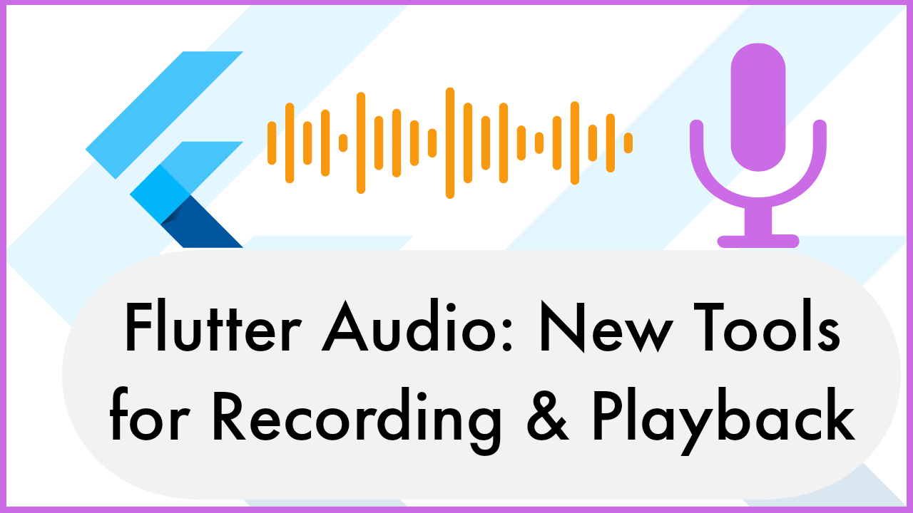

# Record and Play Audio in Flutter

Dive deeper into the world of Flutter audio applications with our latest tutorial, "Flutter Audio: New Tools for Recording & Playback". Building on the foundation of our previous guide, "An Audio Recorder and Player with Flutter", this video explores new packages to elevate your audio recording and playback capabilities in Flutter.

Check out [this tutorial](https://youtu.be/32SL_gxH7t4)

